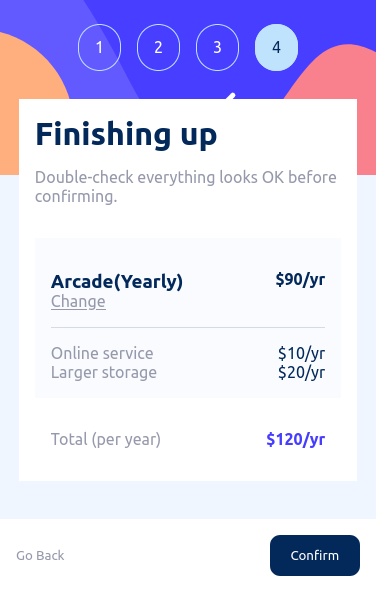

## Multi Step Form 

### Built with

- HTML 
- Css
- JavaScript

### Link

- Live Site URL: [click here](https://your-live-site-url.com)

### The challenge

Users should be able to:

- Complete each step of the sequence
- Go back to a previous step to update their selections
- See a summary of their selections on the final step and confirm their order
- View the optimal layout for the interface depending on their device's screen size
- See hover and focus states for all interactive elements on the page
- Receive form validation messages if:
  - A field has been missed
  - The email address is not formatted correctly
  - A step is submitted, but no selection has been made

### Screenshot

### Desktop view --->

### Mobile view --->

